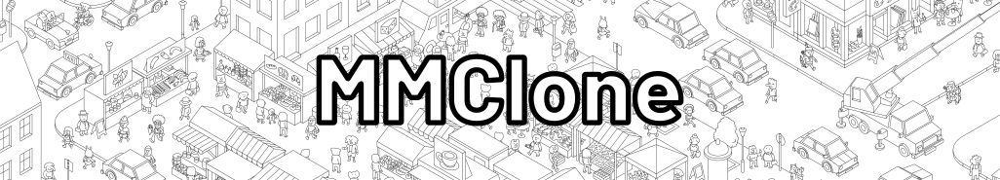

A game (framework) to load and play MicroMacro-like wimmelbild maps and cases.
Uses Leaflet to show the map.

You need to first load a map before being able to play. A test map is available through the menu (Click "Load Test Map").

# How to create a map from a image
To transform a image to raster tiles you can use libvips with this command:

`vips dzsave <image name> --layout google --tile-size 256 --overlap 0 <output name> --suffix .png`

Problems:
- libvips v8.14.2 doesn't contain dzsave rn because of some licensing issues. use v8.14.1
- if images are too small, you may need to adjust the zoom level manually. for a 1080x1920 image i had to use min zoom 8, max zoom 11